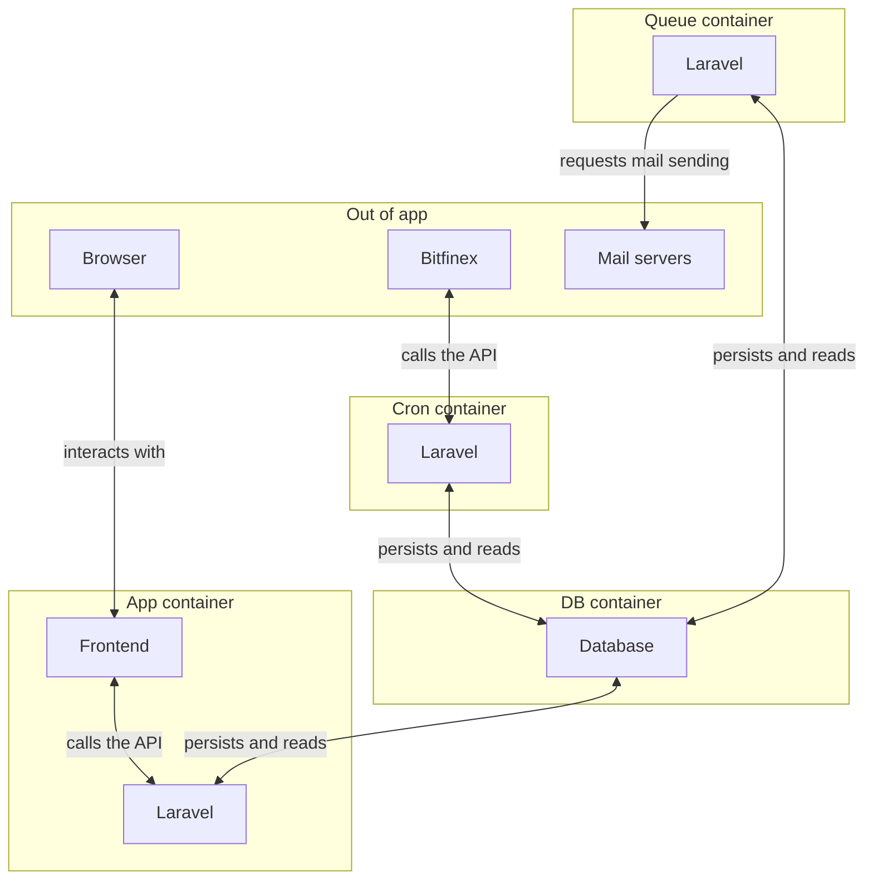

# Bitcoin tracker

A simple laravel based application for tracking the changes in bitcoin price.

## Warning

Currently tested only under Windows 10 with sqlite because of technical issues related to Docker Desktop for Windows, so it requires php locally(described in composer.json).

## Setup

### Running locally

Running locally requires set up docker.

Run the migrations: `php artisan migrate --seed`.

To run the application run the bash command in console 1: `php artisan serve`.

**Temp**: In another console run `php artisan schedule:run`. After the dockerization is fixed this should be obsolete.

**Temp**: In another console run `php artisan queue:work`. After the dockerization is fixed this should be obsolete.

### Hooks

The project's git hooks aim to alert if there is an issue on stage committing and pushing to save CI time to get the feedback. 

Run in a bash console `cp pre-commit .git/hooks`.

### Style

This feature aims to reduce the code smell by detecting style issues using trusted tools.

Run in a bash console `composer style`.

### Testing

The project's tests aim to guarantee the final product's quality by running scenarios to be sure the application's behavior is as expected. 

Run in a bash console `composer test`.

## Diagram

## Check list
- [ ] Manual testing
- [ ] Tests & coverage
- [ ] Logging
- [ ] Error handling

## TODOs:
- [x] General diagram
- [ ] Initial/Basic
- - [x] Laravel setup
- - [ ] Dockerize
- - [x] Clean default files
- [x] Bitcoin price getter
- - [x] Client
- - [x] DTO
- - [x] Adapter
- - [x] Error handling
- - [x] Caching
- - [x] Test coverage
- [x] Price action/notification
- - [x] Model + migration
- - [x] Request
- - [x] DTO
- - [x] Persist endpoint
- - [x] Test coverage
- [x] New price
- - [x] Sending mails
- - [x] True to false toggling 'active' flag 
- - [x] False to true toggling 'active' flag
- - [x] Test coverage
- [ ] Containers
- - [ ] Cron
- - [ ] Queue
- - [ ] Test(should include Xdebug)

## Design decision notes

- I use an abstraction to get Bitcoin price to make able adding another source besides Bitfinex
- I use `new class implements ...` to create single use class instances instead of creating dedicated class
- Using single table with email and price, instead of dedicated table for emails to prevent the possible performance issues caused by the JOIN statements
- At PriceChangeNotificationService::notifySubscribers uses individual updates to simplify the design but hurts the performance
